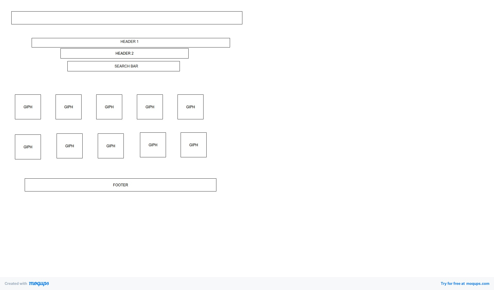

# GIF PROJECT 2
# CONTACT INFO
[LINKEDIN](https://www.linkedin.com/in/michael-moore-b0b769385/)
# SOFTWARE USED -
- HTML
- CSS
- JAVA SCRIPT
- GIPHY-API KEY
# USER STORIES
1. User wants to see certain Gifs by using search bar
2. User is wanting easy using website to find all of their favortie gifs and photos
3. User is needing a image based website with simple acess with a live url link.
# WIRE FRAME

